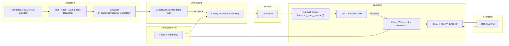
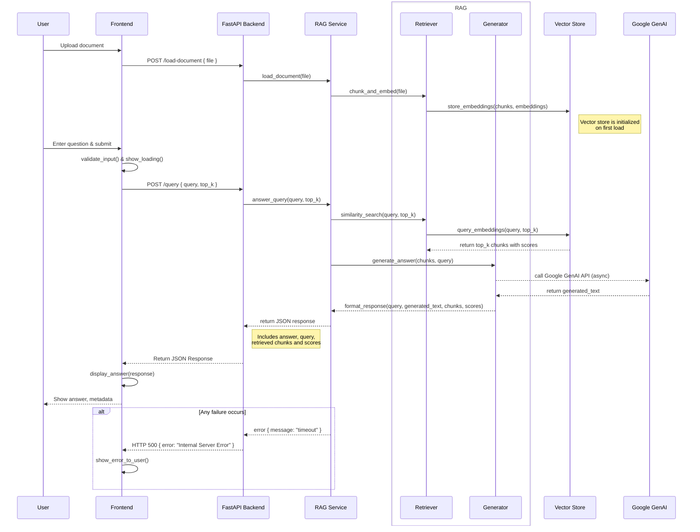

# RAG Pipeline: Full Implementation Guide

This document outlines a complete Retrieval-Augmented Generation (RAG) pipeline using Python, LlamaIndex, FastAPI, PostgreSQL+pgvector or ChromaDB, and Google GenAI (Gemini) for embeddings and LLM generation.

## Tech Stack & Tools
- **Python 3.9+**
- **LlamaIndex** for data ingestion, chunking, and query engines
- **Google GenAI Embeddings** (`GoogleGenAIEmbedding`) for vectorization
- **Google GenAI LLM** (`GoogleGenAI`) for answer generation
- **FastAPI** for building the backend API
- **Uvicorn** as the ASGI server
- **ChromaDB** or **PostgreSQL + pgvector** for vector storage
- **Mermaid** for architecture & sequence diagrams in Markdown
- **Docker** & **docker-compose** for containerization

## System Architecture



## API Sequence Diagram




## Implementation Outline

1. **Setup & Dependencies**
    ```bash
    python3 -m venv .venv
    source .venv/bin/activate
    pip install fastapi uvicorn llama-index llama-index-embeddings-google-genai chromadb psycopg2-binary python-dotenv
    ```

2. **Data Ingestion & Chunking**
    ```python
    from llama_index import SimpleDirectoryReader
    from langchain.text_splitter import RecursiveCharacterTextSplitter

    docs = SimpleDirectoryReader("database/texts").load_data()
    chunks = RecursiveCharacterTextSplitter(chunk_size=1000, chunk_overlap=200).split_documents(docs)
    ```

3. **Embedding & Indexing**
    ```python
    from llama_index.embeddings.google_genai import GoogleGenAIEmbedding
    from llama_index import VectorStoreIndex, StorageContext

    embed_model = GoogleGenAIEmbedding(model_name="text-embedding-005", api_key=os.getenv("GOOGLE_API_KEY"))
    storage_ctx = StorageContext.from_defaults(persist_dir="./.index_storage")
    index = VectorStoreIndex.from_documents(chunks, embed_model=embed_model, storage_context=storage_ctx)
    storage_ctx.persist()
    ```

4. **Backend API**
    ```python
    from fastapi import FastAPI
    from pydantic import BaseModel
    from services.rag_service import answer_query

    app = FastAPI()

    class QueryRequest(BaseModel):
        query: str
        top_k: int = 3

    @app.post("/query")
    def query_endpoint(req: QueryRequest):
        return {"answer": answer_query(req.query, req.top_k)}
    ```

5. **Docker Compose**
    ```yaml
    version: "3.8"
    services:
      backend:
        build: ./backend
        ports:
          - "8000:8000"
        volumes:
          - ./database/texts:/app/database/texts
          - ./backend/.index_storage:/app/.index_storage

      vectorstore:
        image: postgres:15
        environment:
          POSTGRES_DB: rag
          POSTGRES_USER: rag
          POSTGRES_PASSWORD: rag
        volumes:
          - ./postgres-data:/var/lib/postgresql/data
    ```
