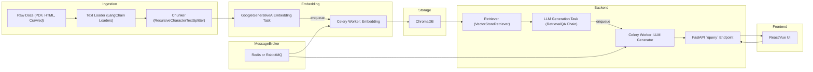
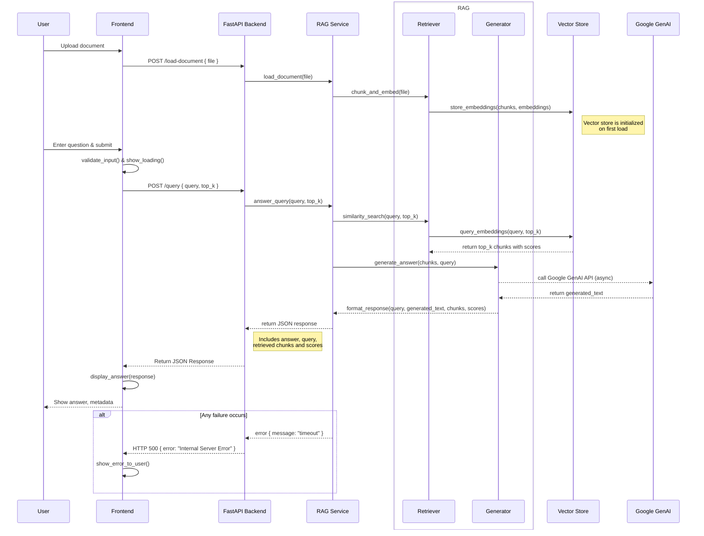

# RAG Pipeline: Full Implementation Guide

This document outlines a complete Retrieval-Augmented Generation (RAG) pipeline using Python, **LangChain**, FastAPI, PostgreSQL+pgvector or ChromaDB, and Google GenAI (Gemini) for embeddings and LLM generation.

## Tech Stack & Tools
- **Python 3.9+**
- **LangChain** for data ingestion, chunking, retrieval, and query chains
- **Google GenAI Embeddings** (`GoogleGenerativeAIEmbeddings`) for vectorization
- **Google GenAI LLM** (`ChatGoogleGenerativeAI`) for answer generation
- **FastAPI** for building the backend API
- **Uvicorn** as the ASGI server
- **ChromaDB** or **PostgreSQL + pgvector** for vector storage
- **Mermaid** for architecture & sequence diagrams in Markdown
- **Docker** & **docker-compose** for containerization

## System Architecture



## API Sequence Diagram



## Implementation Outline

1. **Setup & Dependencies**
    ```bash
    python3 -m venv .venv
    source .venv/bin/activate
    pip install fastapi uvicorn langchain langchain-community langchain-google-genai chromadb psycopg2-binary python-dotenv
    ```

2. **Data Ingestion & Chunking**
    ```python
    from langchain_community.document_loaders import DirectoryLoader
    from langchain.text_splitter import RecursiveCharacterTextSplitter

    loader = DirectoryLoader("database/texts", glob="**/*.txt")
    docs = loader.load()
    text_splitter = RecursiveCharacterTextSplitter(chunk_size=1000, chunk_overlap=200)
    chunks = text_splitter.split_documents(docs)
    ```

3. **Embedding & Indexing**
    ```python
    from langchain_google_genai import GoogleGenerativeAIEmbeddings
    from langchain_community.vectorstores import Chroma
    import os

    embed_model = GoogleGenerativeAIEmbeddings(model="text-embedding-001", google_api_key=os.getenv("GOOGLE_API_KEY"))
    vectorstore = Chroma.from_documents(documents=chunks, embedding=embed_model, persist_directory="./.index_storage")
    vectorstore.persist()
    ```

4. **Backend API**
    ```python
    from fastapi import FastAPI
    from pydantic import BaseModel
    from langchain_google_genai import ChatGoogleGenerativeAI
    from langchain.chains import RetrievalQA

    app = FastAPI()

    class QueryRequest(BaseModel):
        query: str
        top_k: int = 3

    llm = ChatGoogleGenerativeAI(model="gemini-pro", google_api_key=os.getenv("GOOGLE_API_KEY"))
    vectorstore = Chroma(persist_directory="./.index_storage", embedding_function=GoogleGenerativeAIEmbeddings(model="text-embedding-001"))
    retriever = vectorstore.as_retriever(search_kwargs={"k": 3})
    qa_chain = RetrievalQA.from_chain_type(llm=llm, chain_type="stuff", retriever=retriever)

    @app.post("/query")
    def query_endpoint(req: QueryRequest):
        result = qa_chain.run(req.query)
        return {"answer": result}
    ```

5. **Docker Compose**
    ```yaml
    version: "3.8"
    services:
      backend:
        build: ./backend
        ports:
          - "8000:8000"
        volumes:
          - ./database/texts:/app/database/texts
          - ./backend/.index_storage:/app/.index_storage

      vectorstore:
        image: postgres:15
        environment:
          POSTGRES_DB: rag
          POSTGRES_USER: rag
          POSTGRES_PASSWORD: rag
        volumes:
          - ./postgres-data:/var/lib/postgresql/data
    ```