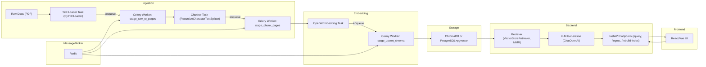
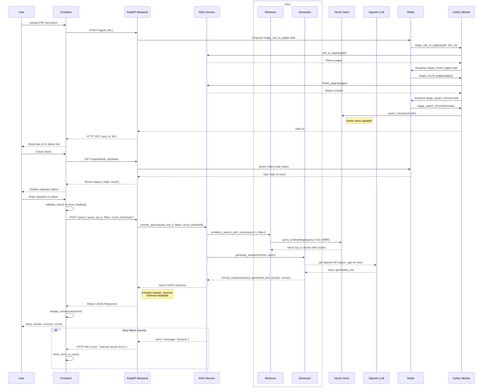

# RAG Pipeline: Full Implementation Guide

This document outlines a complete Retrieval-Augmented Generation (RAG) pipeline using Python, **LangChain**, FastAPI, ChromaDB or PostgreSQL+pgvector, OpenAI for embeddings and LLM generation, and Celery for asynchronous task processing.

## Tech Stack & Tools
- **Python 3.9+**
- **LangChain** for data ingestion, chunking, retrieval, and query chains
- **OpenAI Embeddings** (`OpenAIEmbeddings`) for vectorization
- **OpenAI LLM** (`ChatOpenAI` with `gpt-4o-mini`) for answer generation
- **FastAPI** for building the backend API
- **Uvicorn** as the ASGI server
- **ChromaDB** or **PostgreSQL + pgvector** for vector storage
- **Celery** with **Redis** for async task processing
- **Mermaid** for architecture & sequence diagrams in Markdown
- **Docker** & **docker-compose** for containerization

## System Architecture



## API Sequence Diagram



## Implementation Outline

1. **Setup & Dependencies**
    ```bash
    python3 -m venv .venv
    source .venv/bin/activate
    pip install fastapi uvicorn langchain langchain-community langchain-openai chromadb psycopg2-binary python-dotenv celery redis pypdf
    ```

2. **Data Ingestion & Chunking**
    - PDFs are ingested asynchronously via a Celery task pipeline (`stage_raw_to_pages`, `stage_chunk_pages`).
    - Files are uploaded to `/ingest` or referenced via `/ingest-existing`.
    ```python
    from langchain_community.document_loaders import PyPDFLoader
    from langchain.text_splitter import RecursiveCharacterTextSplitter

    def pdf_to_pages(path: str) -> List[Document]:
        loader = PyPDFLoader(path)
        return loader.load()

    def chunk_pages(pages: List[Document]) -> List[Document]:
        splitter = RecursiveCharacterTextSplitter(chunk_size=1000, chunk_overlap=200)
        return splitter.split_documents(pages)
    ```

<!-- 3. **Embedding & Indexing**
    - Embeddings are generated using OpenAI and stored in ChromaDB or PostgreSQL+pgvector.
    ```python
    from langchain_openai import OpenAIEmbeddings
    from langchain_chroma import Chroma
    import os

    embed_model = OpenAIEmbeddings(openai_api_key=os.getenv("OPENAI_API_KEY"), base_url=os.getenv("OPENAI_BASE_URL"))
    vectorstore = Chroma.from_documents(
        documents=chunks,
        embedding=embed_model,
        persist_directory=os.getenv("INDEX_PERSIST_DIR", "./.index_storage"),
        collection_name="rag"
    )
    vectorstore.persist()
    ```

4. **Backend API**
    - FastAPI endpoints handle document ingestion, querying, and index management.
    ```python
    from fastapi import FastAPI, UploadFile, File
    from pydantic import BaseModel
    from langchain_openai import ChatOpenAI
    from backend.src.services.rag_service import answer_query, upsert_chunks

    app = FastAPI(title="RAG API")

    class QueryRequest(BaseModel):
        query: str
        top_k: int = 6
        filters: dict | None = None
        score_threshold: float | None = None

    @app.post("/query")
    async def query_endpoint(req: QueryRequest):
        return await answer_query(
            query=req.query,
            k=req.top_k,
            filters=req.filters,
            score_threshold=req.score_threshold
        )

    @app.post("/ingest")
    async def ingest(file: UploadFile = File(...)):
        data_dir = os.getenv("DATA_DIR", "./database/pdfs")
        os.makedirs(data_dir, exist_ok=True)
        dst = os.path.join(data_dir, file.filename)
        with open(dst, "wb") as buf:
            shutil.copyfileobj(file.file, buf)
        task_id = start_ingest_pipeline(dst)
        return {"task_id": task_id, "file": file.filename}
    ```

5. **Celery Task Pipeline**
    - Asynchronous ingestion with three Celery tasks: PDF loading, chunking, and upserting to vector store.
    ```python
    from celery import Celery
    from backend.src.services.ingest_utils import pdf_to_pages, chunk_pages
    from backend.src.services.rag_service import upsert_chunks

    celery_app = Celery("rag_ingest", broker=os.getenv("REDIS_URL", "redis://localhost:6379/0"))

    @celery_app.task
    def stage_raw_to_pages(payload):
        pages = pdf_to_pages(payload["path"])
        return {"doc_id": payload.get("doc_id"), "path": payload["path"], "pages": [p.dict() for p in pages]}

    @celery_app.task
    def stage_chunk_pages(payload):
        pages = [Document(**p) for p in payload["pages"]]
        chunks = chunk_pages(pages)
        return {**payload, "chunks": [c.dict() for c in chunks]}

    @celery_app.task
    def stage_upsert_chroma(payload):
        chunks = [Document(**c) for c in payload["chunks"]]
        n = upsert_chunks(chunks)
        return {"doc_id": payload["doc_id"], "path": payload["path"], "upserted": n}
    ``` -->

3. **Docker Compose**
    ```yaml
    version: "3.8"
    services:
      backend:
        build: ./backend
        ports:
          - "8000:8000"
        volumes:
          - ./database/pdfs:/app/database/pdfs
          - ./backend/.index_storage:/app/.index_storage
        environment:
          - OPENAI_API_KEY=${OPENAI_API_KEY}
          - OPENAI_BASE_URL=${OPENAI_BASE_URL}
          - DATA_DIR=/app/database/pdfs
          - INDEX_PERSIST_DIR=/app/.index_storage
          - REDIS_URL=redis://redis:6379/0

      vectorstore:
        image: postgres:15
        environment:
          POSTGRES_DB: rag
          POSTGRES_USER: rag
          POSTGRES_PASSWORD: rag
        volumes:
          - ./postgres-data:/var/lib/postgresql/data

      redis:
        image: redis:7
        ports:
          - "6379:6379"
    ```

4. **API Endpoints**
    - `GET /health`: Check server status.
    - `POST /query`: Query the RAG pipeline with a question, optional filters, and score threshold. Returns answer, sources, and retrieval metadata.
    - `POST /ingest`: Upload a PDF and enqueue it for async ingestion.
    - `POST /ingest-existing`: Enqueue an existing PDF for ingestion.
    - `GET /ingest/{task_id}/status`: Check the status of an ingestion task (PENDING, STARTED, SUCCESS, FAILURE, RETRY).
    - `POST /rebuild-index`: Rebuild the vector index from stored documents.
    - `GET /sources`: List available PDF sources in the data directory.

## Additional Notes
- **Environment Variables**: Set `OPENAI_API_KEY`, `OPENAI_BASE_URL`, `DATA_DIR`, `INDEX_PERSIST_DIR`, and `REDIS_URL` in a `.env` file or Docker environment.
- **CORS**: Configured to allow frontend access from `http://localhost:5173` and `http://127.0.0.1:5173`.
- **Async Ingestion**: Uses Celery with Redis for task queuing, with tasks for PDF loading, chunking, and upserting to the vector store.
- **Retrieval**: Uses Maximum Marginal Relevance (MMR) with deduplication to ensure diverse, relevant results. Supports filtering and score thresholding.
- **Scalability**: The pipeline supports large document sets via async ingestion and persistent vector storage.
